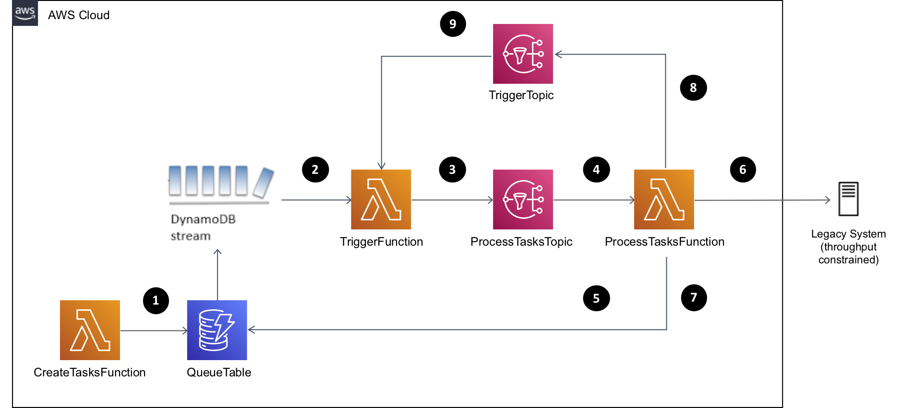

# AWS Serverless LIFO Queue Demonstration

This demonstration application shows an approach to implementing a Last-In, First-Out (LIFO) queue, using 
[AWS Lambda](https://aws.amazon.com/lambda/), [Amazon DynamoDB](https://aws.amazon.com/dynamodb/) and 
other [AWS Serverless](https://aws.amazon.com/serverless/) technologies. The demonstration is an
[AWS Serverless Application Model](https://aws.amazon.com/serverless/sam/) (AWS SAM) application and is 
written in JavaScript.

We created the application as a companion to an AWS Compute Blog post (see link below). The post also 
describes a use case where this approach is useful.   

https://aws.amazon.com/blogs/compute/implementing-a-lifo-task-queue-using-aws-lambda-and-amazon-dynamodb/

The demonstration supports use cases where a system must prioritise newer tasks over older 
tasks, and where older tasks can be deleted under insurmountable high load (via load 
shedding). For these use cases a First-In, First-Out (FIFO) queue implementation is not 
appropriate, as the oldest tasks (first in) would be prioritised, and load shedding would 
be applied to newer tasks (last in), which is the opposite of what’s required.

Under low load (sufficient capacity), the newest tasks will take priority, but eventually all tasks 
would be processed. Under heavy load (constrained capacity), the newest tasks still take priority, but 
older tasks will be buffered, and may eventually be dropped (load shedding). Under conditions of 
insurmountable load, this approach allows the system to continue doing useful work with fresh 
tasks, but to eventually give up on older stale tasks.

The application is not production-ready, it is a demonstration. You can run the application 
using AWS SAM. Instructions are below.

## Architecture

### Resources

The application consists of the following resources defined in the AWS SAM template:

* `QueueTable`: An [Amazon DynamoDB](https://aws.amazon.com/dynamodb/) table containing queue task items.
* `TriggerFunction`: An [AWS Lambda](https://aws.amazon.com/lambda/) function which triggers queue task item processing.
* `ProcessTasksFunction`: An AWS Lambda function which processes queue task items.
* `CreateTasksFunction`: An AWS Lambda function which creates queue task items.
* `TriggerTopic`: An [Amazon Simple Notification Service](https://aws.amazon.com/sns/) (SNS) topic which `TriggerFunction` subscribes to.
* `ProcessTasksTopic`: An Amazon SNS topic which `ProcessTasksFunction` subscribes to.

### Diagram

1. `CreateTasksFunction` inserts task items into `QueueTable` with `PENDING` state.
1. A DynamoDB stream invokes `TriggerFunction` for all item activity in `QueueTable`.
1. `TriggerFunction` publishes a notification on `ProcessTasksTopic` if task items should be processed.
1. `ProcessTasksFunction` subscribes to `ProcessTasksTopic`.
1. `ProcessTasksFunction` fetches `PENDING` task items from `QueueTable` for up 
   to 1 minute, or until all `PENDING` task items have been processed.
1. `ProcessTasksFunction` processes each `PENDING` task item by calling the legacy system.
1. `ProcessTasksFunction` updates each task item during processing to 
   reflect state (first to `TAKEN`, and then to `SUCCESS`, `FAILURE` or `PENDING`).
1. `ProcessTasksFunction` publishes an SNS notification on `TriggerTopic` if `PENDING` task 
   items remain in the queue.
1. `TriggerFunction` subscribes to `TriggerTasksTopic`.

Activity continues whilst `QueueTable` events are sent on the stream (2) or notifications are 
published on `TriggerTasksTopic` (9).

## Design

### Selecting Tasks to Process, with LIFO Priority

* `ProcessTasksFunction` gets tasks by querying the `QueueTable` Global Secondary Index (GSI).
* The query returns
  * a small page of task items (e.g. 10 tasks),
  * with a state of `PENDING`,
  * sorted by created timestamp descending (LIFO).
* Some older `PENDING` tasks may never be selected under insurmountable load.

### Processing Queue Tasks

* Before processing a task, `ProcessTasksFunction` transitions the `taskStatus` attribute 
  from `PENDING` to `TAKEN`.
* When updating the task item, a DynamoDB [Update Expression](https://docs.aws.amazon.com/amazondynamodb/latest/developerguide/Expressions.UpdateExpressions.html) 
  and [Condition Expression](https://docs.aws.amazon.com/amazondynamodb/latest/developerguide/Expressions.ConditionExpressions.html)
  updates the `taskStatus` attribute to `TAKEN` only if the value is still `PENDING`.
* This technique ensures the task is processed only once, and protects against multiple concurrently 
  invoked functions (this shouldn’t happen, but we must still be careful).
* The application contains a fake implementation of task processing logic.

### Updating Queue Tasks after Processing

* Once processing for a task is complete, the function updates the `taskStatus` attribute to `SUCCESS`, `FAILURE` or 
  `PENDING`, depending on the outcome of the task work.
* If the function updated the `taskStatus` attribute to `PENDING`, it is effectively placed back on the queue. The task 
  drops in priority compared to newer tasks (as the created timestamp is not updated).
* When the task item is updated an Update Expression and Condition Expression (as described above) 
  protects against concurrent and invalid modifications.

### Handling Insurmountable Load

* When the load reaches an insurmountable level some tasks will never be selected for processing, and a backlog 
  will build up. Each time `ProcessTasksFunction` polls for batches of `PENDING` tasks to 
  process, it selects those tasks based on created timestamp, in descending order. If the rate of new 
  task creation exceeds the rate of task processing then the backlog will build up.
* To avoid an ever-growing task backlog `QueueTable` is configured to delete the backlog items when the TTL timestamp of 
  each item expires.

### Adapting for Production Workloads

Here are a few things to consider if you intend to use the implementation in this demonstration application 
as inspiration for your own system:

* Read and understand the demonstration code carefully, and especially aim to understand how 
  DynamoDB expressions have been implemented.
* You will need your own approach to creating the task items. This demonstration application creates fake tasks 
  purely for demonstration purposes (see [app/create_tasks.js](./app/create_tasks.js)).
* You will also need to provide your own real implementation of a task runner. This demonstration application contains 
  only a fake task runner (see [app/task_runner.js](./app/task_runner.js)).
* You may need to use rate limiting (or another similar technique) to protect the downstream system. 
* Think about how you will observe your application. [Amazon CloudWatch](https://aws.amazon.com/cloudwatch/) 
  and [AWS X-Ray](https://aws.amazon.com/xray/) provide good logging and tracing for your application, and 
  this demonstration application has examples of this. 
  
## Implementation

### `QueueTable` Amazon DynamoDB Table for Queue Tasks

* Each `QueueTable` item is a task in the queue.
* Each item contains the following attributes:
  * `taskId`, configured as the table hash key
  * `taskStatus` (e.g. `PENDING` or `SUCCESS`)
  * `taskCreated` (timestamp)
  * `taskUpdated` (timestamp)
  * `ttl` (timestamp), configured as the DynamoDB table TTL attribute
  * potentially other fields relevant to the task work itself
* The table has one Global Secondary Index (GSI)
  * `taskStatus` is the hash key and
  * `taskCreated` is the range key.
* A DynamoDB stream is configured, which is an event source for `TriggerFunction`. 
* DynamoDB Condition Expressions and Update Expressions ensure atomic and exclusive database item
  modification (e.g. for transition the state of each queue task item).
* See `QueueTable` in [template.yaml](./template.yaml).

### `TriggerFunction` AWS Lambda Function

* `TriggerFunction` is a proxy for `ProcessTasksFunction` (see below).
* The function is invoked by:
  * Events from the `QueueTable` DynamoDB Stream. 
  * Notifications on `TriggerTopic`.
* Notifications published on `TriggerTopic` are [tail calls](https://en.wikipedia.org/wiki/Tail_call) 
  from `ProcessTasksFunction`.
* `TriggerFunction` calls `ProcessTasksFunction` if an event is:
  * An INSERT into `QueueTable` (filters out all other DynamoDB events).
  * Any notification on `TriggerTopic` (all tail calls).
* The DynamoDB stream event source is configured so that table events arrive quickly, in batches of
  10, with maximum 10 seconds delay.
* The function is configured without a concurrency limit to minimise the risk of missing trigger events.  
* The function is configured for **zero** retries on asynchronous invocation to avoid redundant attempts
  to invoke `ProcessTasksFunction`.
* See `TriggerFunction` in [template.yaml](./template.yaml) and [app/trigger.js](./app/trigger.js).

### `ProcessTasksFunction` AWS Lambda Function

* `ProcessTasksFunction` implements the LIFO queue behaviour.
* The function is called by `TriggerFunction`, via `ProcessTasksTopic`.
* Whilst the function is executing it polls for `PENDING` tasks, and works on those tasks.
* The function remains active for up to 1 minute, and then exits.
* If there are no more `PENDING` tasks (after polling), the function will exit.
* Before the function exits, if there are remaining `PENDING` tasks, the function will tail 
  call `TriggerFunction` (by publishing on `TriggerTopic`), so that any remaining tasks can be processed.
* Each task is transitioned from `PENDING` to `TAKEN` state, and then following processing by task runner 
  logic, the task is transitioned to `SUCCESS` or `FAILURE` state.
* A fake implementation of task runner logic simulates integration with a throughput constrained external system.
* The function has a concurrency limit of 1, so that the function is in control of task processing concurrency.
* The function is configured for **one** retry on asynchronous invocation, to minimise the risk of 
  missing a notification that there are `PENDING` state task items.
* See `ProcessTasksFunction` in [template.yaml](./template.yaml) and [app/process_tasks](./app/process_tasks.js).

### `CreateTasksFunction` AWS Lambda Function

* `CreateTasksFunction` creates and inserts fake task items into `QueueTable`, and has fake task 
  processing logic.
* A real application would insert real task items into the table, and provide real task processing logic.
* On creation, the `taskStatus` attribute is updated to `PENDING`.
* The task item `ttl` attribute is set to 1 hour into the future, so that DynamoDB TTL functionality will delete the
  items once they expire.
* See `CreateTasksFunction` in [template.yaml](./template.yaml) and [app/create_tasks](./app/create_tasks.js).

### Observation with Amazon CloudWatch and AWS X-Ray

* Structured logging statements (JSON objects) enable detailed log analysis
  with [Amazon CloudWatch Logs Insights](https://docs.aws.amazon.com/AmazonCloudWatch/latest/logs/AnalyzingLogData.html).
* [AWS X-Ray](https://aws.amazon.com/xray/) tracing is added to the Lambda configuration and X-Ray
  captures and wraps the DynamoDB and SNS client objects.

## Running the Application

### Costs

**Important**: this application uses various AWS services and there are costs associated with these services after 
the Free Tier usage - please see the AWS Pricing page for details. You are responsible for any AWS 
costs incurred. No warranty is implied in this demonstration application.

### Requirements

* An AWS account. ([Create an AWS account](https://portal.aws.amazon.com/gp/aws/developer/registration/index.html) if you do not already have one and login.)
* AWS CLI already configured with Administrator permission.
* [AWS SAM CLI installed](https://docs.aws.amazon.com/serverless-application-model/latest/developerguide/serverless-sam-cli-install.html). (the application was developed with version 1.22.0)
* [NodeJS 14.x installed](https://nodejs.org/en/download/).

### Deployment

* Build and deploy the demonstration application using AWS SAM.
* If you're not familiar with SAM then a good place to start is 
  the [Getting started with AWS SAM](https://docs.aws.amazon.com/serverless-application-model/latest/developerguide/serverless-getting-started.html) page.

### Creating Queue Tasks

* Use `CreateTasksFunction` to experiment with creating task items.
* You can invoke the function directly in the AWS Management Console.
* You could also use Amazon CloudWatch [Schedule Expressions for Rules](https://docs.aws.amazon.com/AmazonCloudWatch/latest/events/ScheduledEvents.html) to invoke 
  the function on a schedule.
* The function creates a few `PENDING` task items. If you invoke the function 
  repeatedly (either manually or via a schedule) then you will be simulating a flow of 
  tasks into the system. 

### Monitoring Queue Task Processing

Here are some suggestions on how to monitor task queue processing:

* Look at the items in `QueueTable`, especially the `taskStatus` attribute. Watch for tasks transitioning
  from `PENDING` to `TAKEN` and so on.
* Look at the application logs in Amazon CloudWatch Insights. Filter the log events based on the 
  structured logging attributes.
* Look at the application traces in AWS X-Ray. This is a good way to see the tail calls in action.

### Clean Up

* You can clean up the demonstration application by deleting the associated CloudFormation stack.
* You may need to manually delete some resources, such as the CloudWatch log groups. 

## Security

See [CONTRIBUTING](CONTRIBUTING.md#security-issue-notifications) for more information.

## License

This demonstration application is licensed under the MIT-0 License. See the [LICENSE](./LICENSE) file.